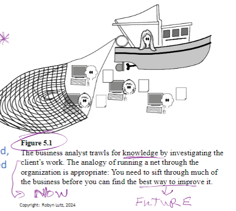
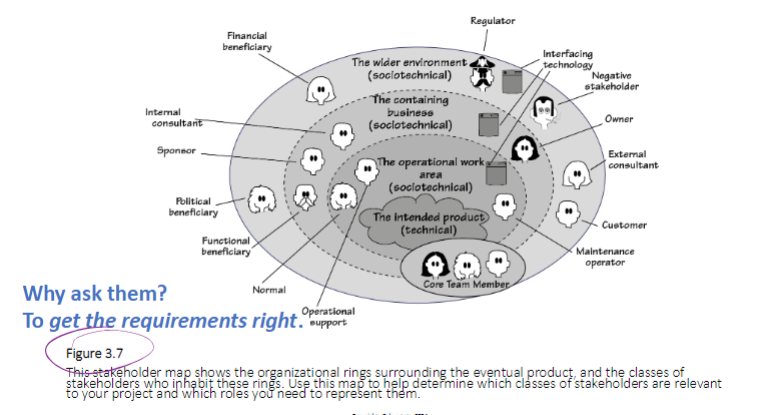
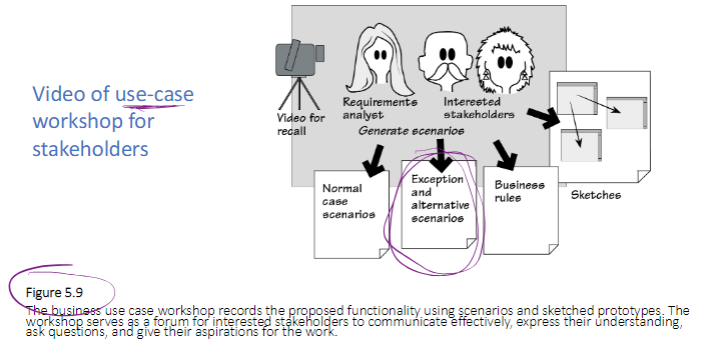
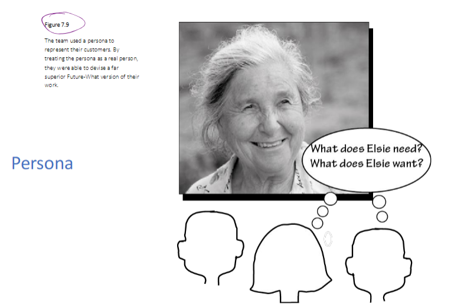
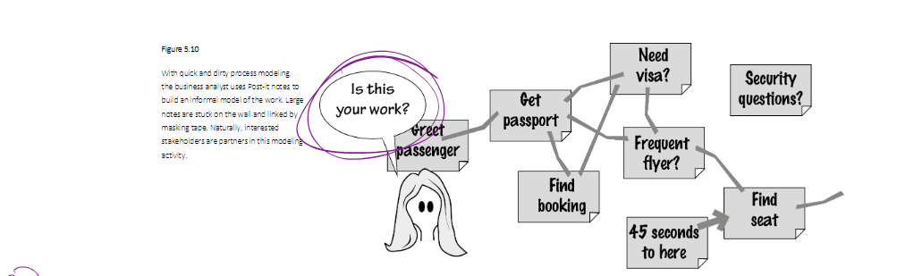
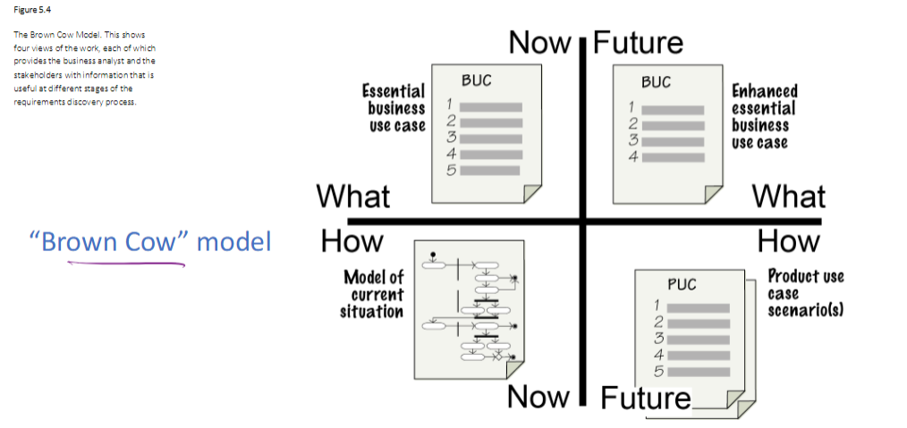

## 1. Trawling for Requirements
- Trawling is the process of investigating the client's work to identify the right requirements.
- **Figure 5.1**: Shows the business analyst trawling for knowledge through the organization to improve business processes.

---

## 2. Stakeholder Identification (Chapters 5 & 7)
- Stakeholders: Anyone with an interest in the product and its requirements (e.g., client, user, developer, auditor, safety inspector).
- Use stakeholder maps to identify all relevant parties.

---

## 3. Techniques for Successful Communication with Stakeholders
- **Active investigation**: Probe for unconscious requirements.
- **Modeling**: Use context diagrams, use cases, and scenarios to communicate.
- **Apprentice role**: Observe the user's process and patterns.
- **Social media and surveys**: Use these to gather feedback and insights.
  

---

## 4. Persona and User Interface Design
- Personas help in understanding user needs by representing typical users.
- Always consider the perspective of the persona when designing the user interface.

---

## 5. Interviewing Stakeholders
- Ask stakeholders about their work, needs, and how they envision the software.
- Confirm understanding by providing feedback and iterating until an agreement is reached.
  

---

## 6. Communication Gaps and Their Causes
- Large-scale projects often suffer from missing common views or poorly communicated tacit requirements.
- Temporal aspects, such as hand-offs between teams, can lead to misunderstandings of requirements.
- Decision structures may fail to align with stakeholder needs.

---

## 7. Summary
- Communicating with stakeholders involves constant interaction, feedback, and validation.
- Trawling, interviewing, and modeling techniques are essential in gathering the right requirements.
- Understanding communication gaps and mitigating them early on leads to better project outcomes.

---

