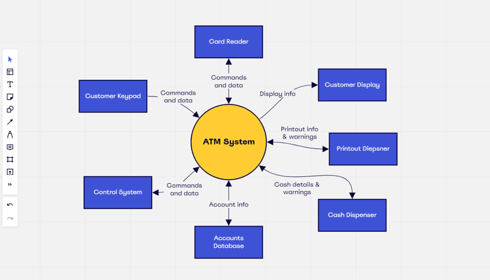
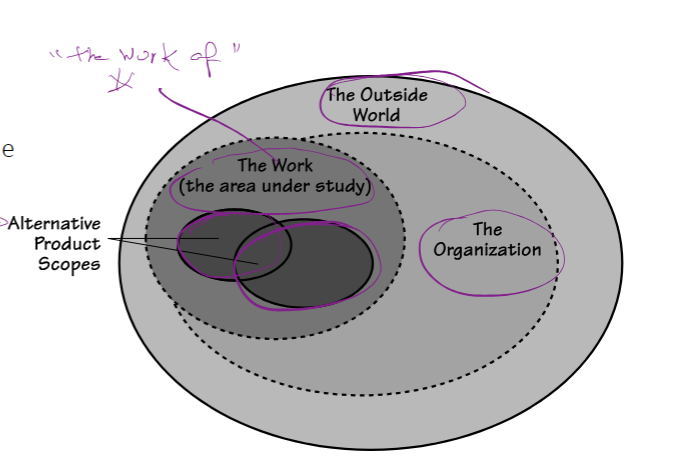
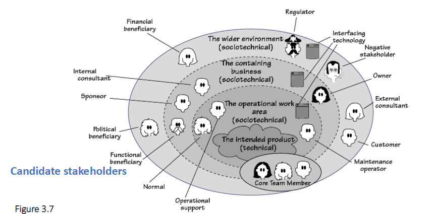

# Study Guide: Requirements Discovery & Analysis
## Context Diagrams

### Key Concepts
- **Context Diagram**: A model representing the scope of a system and its interaction with external entities (adjacent systems, users).  
- The diagram identifies the flow of data between the system and adjacent systems but does not dive into internal system details.  
- **Example**: IceBreaker context diagram shows the flow of data between road prediction systems and entities like weather services and truck dispatch.

  

### Importance
- Helps define the scope of the project by showing external interactions.
- Enables clear communication about what the system will and won’t include.

## Types of Requirements

### 1. Functional Requirements
- Describes what the system must do.
- **Example**: “The system shall generate an updated schedule when a truck's status changes.”

### 2. Non-functional Requirements
- Defines qualities or attributes the system must have.
- **Example**: "The system must produce the amended schedule within 0.25 seconds."

### 3. Constraints
- Limitations or restrictions imposed on the project or product design.
- **Example**: "The system must be operational on mobile devices like iPads."

## Steps in Requirements Discovery

### Step 1: Define the Project Scope
- Scope defines which parts of the business process will be affected by the new system. 
- Use a **Context Diagram** to map the flow of information between the system and external actors.

  

### Step 2: Identify Stakeholders
- **Stakeholders**: Individuals or systems that influence the project or are affected by its outcome. 
- Why is it important? Missing stakeholders can result in overlooked requirements.

  

### Step 3: Identify High-Level Requirements (Goals)
- Focus on the business problem and how the system solves it.
- **Examples of Goals**: 
  - Accurate prediction of icy road conditions.
  - Efficient scheduling of de-icing trucks.
  - Reducing road accidents by ensuring timely action.

## Risk Reduction in Requirements Discovery
- The three critical aspects to minimize risk:
  1. **Scope**: Clearly define the project's scope with a context diagram.
  2. **Stakeholders**: Identify all relevant stakeholders and their input.
  3. **Goals**: Understand the high-level business goals and system requirements.

  (img)[./images/risk_reduction.png]

## Additional Key Points

### Requirements Must Be Measurable
- Functional and non-functional requirements must be measurable and testable. 
- **Example of Measurable Requirement**: First-time users should be able to set up an account within 2 minutes, with less than 5 seconds' hesitation for known data.

### Stakeholders Don’t Always Know the Right Requirements
- The requirements activity is not just transcription; it involves critical thinking and elicitation to refine and discover the true needs.

## Conclusion
- Requirements discovery and analysis form the foundation of system design. Correctly identifying the scope, stakeholders, and goals reduces project risk.
- **Key Tools**: Context Diagrams, stakeholder maps, risk reduction strategies.
