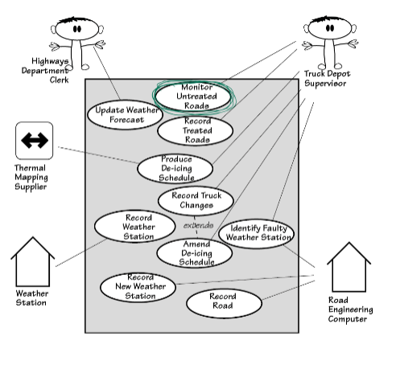
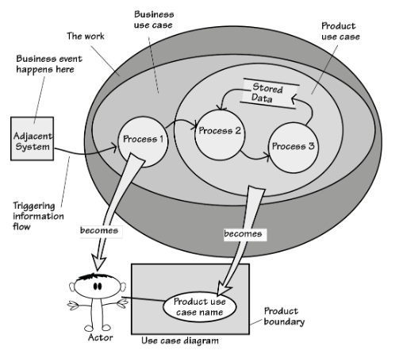

# Study Guide: Requirements Discovery & Analysis (Use Cases)

## Key Concepts

### Use Cases
- A **use case** is a unit of functionality that describes how the system responds to a specific event.
- Use cases can be divided into **business use cases** and **product use cases**.

### Business Use Case
- Represents how the business responds to an event from an adjacent system.
- **Example**: A truck depot reports an issue with a truck.
- **Key Question**: How much of the business use case is handled by the product use case?

### Product Use Case
- The product use case represents the part of the business use case that is handled by the software system.
- **Diagram Elements**:
  - Boundary (rectangle) separating actors and the system.
  - Product use cases (ellipses).
  - Actors (people or systems) interacting with the software product.

  

---

## Use Case Diagrams
- Use case diagrams show the interactions between **actors** and **use cases**.
- Useful for visualizing how the system will work and which parts of the business process are handled by software.

### Advantages
- High-level and informal model that helps stakeholders understand the system.
- Popular and easy for discussions.
- Some regulators require them.
- Useful for planning (builds, tests, prototypes).

### Limitations
- Some functional requirements may be missing.
- Internal processing requirements are often not included.
- Most non-functional requirements and constraints are absent.

**Solution**: Combine use case diagrams with functional requirements for a more complete picture.

    
  *Reference Figure 4.11 for Business Event & Product Use Case Diagram.*

---

## Understanding the Flow of Events
- The flow of events in use cases can trigger system responses.
- **Exercise**: Map each event from the business use case to the corresponding product use case.

  (img)[./images/event_to_use_case_flow.png]  
  *This can be a flowchart showing how events trigger responses and how much is handled by the system.*

---

## Models for Requirements Discovery
- **Models** are abstractions used to discover the real requirements.
- Examples include **Context Diagrams** and **Use Case Diagrams**.
- Models help reveal hidden constraints and help define system boundaries.

---

## Practice
- Develop a draft **Product Use Case Diagram** for the proposed **seismometer-based flood warning system**.  
  (img)[./images/flood_warning_use_case.png]

