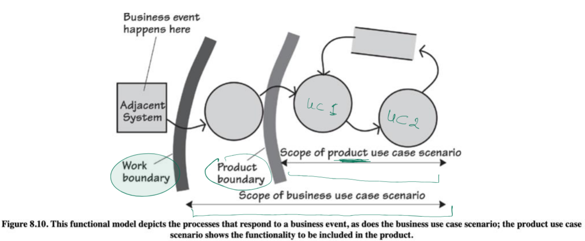

# Study Guide: Requirements Discovery & Analysis (Scenarios)

## Key Concepts

### Scenarios
- A **scenario** tells the story of a use case.
- It breaks down the product use case into steps that stakeholders can recognize.
- Scenarios help to quickly identify, record, and revise functional requirements during meetings with stakeholders.

### Scenario Structure
- Each product use case should have at least one scenario.
- **Steps in a Scenario**:
  1. Trigger (what starts the scenario)
  2. Preconditions (what must be true before the scenario starts)
  3. Actors (who interacts with the system)
  4. Steps (actions the actor and system perform)
  5. Outcome (result of the scenario)

## Use Case Scenario: Passenger Checks into Flight

### Trigger
- The passenger activates the self-check-in machine at the airport.

### Preconditions
- The passenger has an active flight booking.
- The self-check-in machine is connected to the airline system and operational.

### Actors
- **Primary Actor**: Passenger
- **System Actor**: Self-check-in machine

### Steps
1. **Passenger** selects the language on the machine.
2. **System** displays options for checking in.
3. **Passenger** enters booking reference or scans the boarding pass.
4. **System** retrieves the booking details and verifies the identity.
5. **System** asks the passenger to confirm or change the seating preferences.
6. **Passenger** confirms seat or selects a new one.
7. **System** processes the request and updates the booking.
8. **System** asks for the number of bags to check in.
9. **Passenger** enters the number of bags.
10. **System** calculates any additional charges (if applicable) and prompts for payment.
11. **Passenger** pays the additional amount using a credit card.
12. **System** processes the payment and issues a confirmation.
13. **System** prints the boarding pass and baggage tags.

### Outcome
- The passenger receives the boarding pass and baggage tags, successfully completing the check-in process.

---

## Types of Scenarios

### Normal Flow Scenario
- Describes the regular, expected flow of events when everything goes as planned.
  
#### Example: Lab Manager Requests a Chemical
1. **Trigger**: The lab manager submits a request for a chemical from the chemistry storeroom.
2. **Preconditions**: The chemical is available in the storeroom, and the manager has access to the system.
3. **Actors**: 
   - **Lab Manager**: Requests the chemical.
   - **Chemistry Store System**: Manages the inventory of chemicals.
4. **Steps**:
   1. The lab manager logs into the system.
   2. The lab manager selects the required chemical from the inventory.
   3. The system verifies the availability of the chemical.
   4. The system confirms the request and generates a pickup ticket.
5. **Outcome**: The lab manager receives a confirmation and prepares to pick up the chemical.

---

### Alternative Flow Scenario
- Describes a scenario where the actor has a choice or a different path is taken.

#### Example: The Chemical Needs to Be Ordered
1. **Trigger**: The lab manager submits a request for a chemical from the chemistry storeroom.
2. **Preconditions**: The chemical is **not** available in the storeroom, but it can be ordered.
3. **Actors**: 
   - **Lab Manager**: Requests the chemical.
   - **Chemistry Store System**: Manages the inventory of chemicals.
   - **Supplier System**: Processes chemical orders.
4. **Steps**:
   1. The lab manager logs into the system.
   2. The lab manager selects the required chemical from the inventory.
   3. The system checks the availability and informs the manager that the chemical is not in stock.
   4. The system provides an option to order the chemical.
   5. The lab manager selects the order option.
   6. The system connects to the supplier system and places an order.
   7. The system confirms the order and provides an estimated delivery date.
5. **Outcome**: The lab manager receives a confirmation that the chemical has been ordered.

---

### Exception Scenario
- Describes what happens when something goes wrong or there is a failure.

#### Example: The Chemical is Out of Stock and Cannot Be Ordered
1. **Trigger**: The lab manager submits a request for a chemical from the chemistry storeroom.
2. **Preconditions**: The chemical is **not** available in the storeroom, and it **cannot** be ordered due to supplier issues.
3. **Actors**: 
   - **Lab Manager**: Requests the chemical.
   - **Chemistry Store System**: Manages the inventory of chemicals.
4. **Steps**:
   1. The lab manager logs into the system.
   2. The lab manager selects the required chemical from the inventory.
   3. The system checks the availability and informs the manager that the chemical is not in stock.
   4. The system provides an option to order the chemical.
   5. The system attempts to place an order but fails due to supplier issues.
   6. The system informs the lab manager that the chemical cannot be ordered at this time.
5. **Outcome**: The lab manager is notified that the chemical is unavailable, and no order can be placed.

---

## Beyond Normal Scenarios

- **Alternative Paths**: When the actor has multiple choices, creating branching paths.
  - Example: A customer can "buy now" or "save the cart for later."
- **Failure Scenarios**: Unexpected or abnormal cases that deviate from the normal flow.
  - Example: A customer forgets their password.
- **Stopping Criteria**: Consider the probability of exceptions and the seriousness of damage if they occur (Jackson’s Principle of Commensurate Care).

---

## Scenario Limitations

### Drawbacks of Scenarios (Wiegers & Beatty)
- **Partial Coverage**: Scenarios may not capture all possible system behaviors, thus missing some functional requirements.
- **Over-Specification**: If used too early, they can constrain the flexibility of steps, leading to unnecessary constraints.
- **Lack of Rationale**: Scenarios don't capture the "why" of interactions.
- **Non-functional Requirements**: Scenarios often miss capturing quality attributes like performance or usability.

---

## Business and Product Use Case Scenarios

- Use case scenarios help differentiate between the scope of a **business use case** and a **product use case**.
- **Business Use Case**: Includes the entire business process, both manual and automated steps.
- **Product Use Case**: Includes only the parts of the process handled by the software.

    
  *Figure 8.10 from slides: Functional model showing business event, work boundary, product boundary, and the scope of business and product use case scenarios.*

---

## Beyond Scenarios: Storyboarding
- A **storyboard** visually shows the steps of a scenario as a sequence of pictures, making it useful for designing user interfaces and displays.

---

## User Stories
- **User Stories** are derived from business use cases and are commonly used in agile development.
- **Structure**:  
  As a [role], I want [functionality] so that [purpose].
- **Example**:  
  As a [moviegoer], I want [tickets sent to my phone] so that [I can avoid the box office queue].
- User stories capture both functional and non-functional requirements and evolve into more detailed specifications as they move into development.

---

## Practice
- Develop scenarios for the product use case of a **passenger checking into an airline flight** using the template provided.

