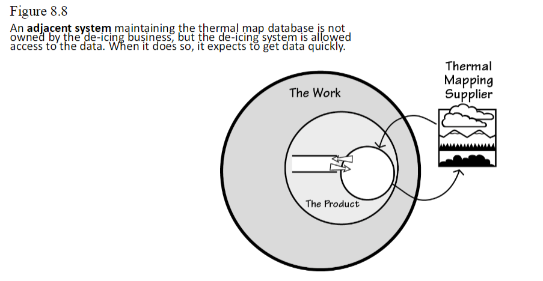
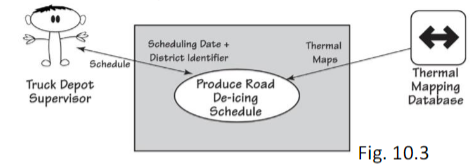
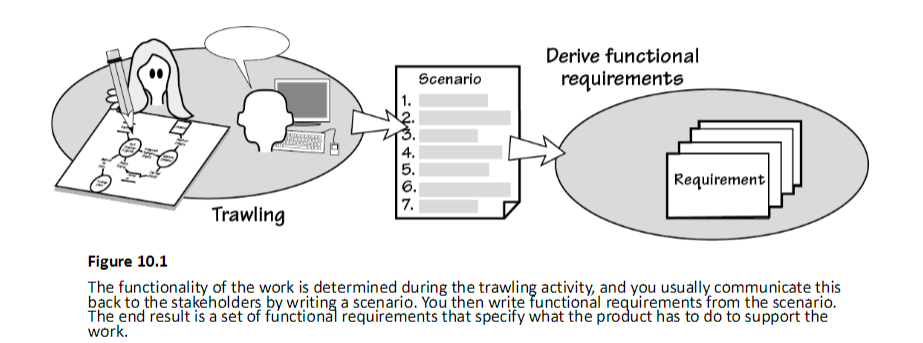

# Study Guide: Requirements Discovery & Analysis (Functional Requirements)

## Key Concepts

### Scenarios to Functional Requirements (FRs)
- **Functional Requirements (FRs)** define what the software product must do.
- They are often derived from the steps of **product use case scenarios**.
- For each scenario and step, ask: "What does the software need to do?"
- A functional requirement typically follows this form:  
  **"The software shall..."**  
  For example: "The software shall generate a de-icing schedule for the specified date and district."

    
  *Figure 8.8: Example from the slides showing system interaction for thermal map data.*

---

## How Scenarios Map to Functional Requirements
- A single product use case often maps to multiple scenarios, and each scenario can contain multiple steps.
- **Rule of Thumb**: A step in a scenario typically maps to 1-5 functional requirements.
  
  #### Example: IceBreaker Scenario to Functional Requirements
  - **Product Use Case**: Produce road de-icing schedule.
  - **Scenario**: Engineer provides scheduling date and district identifier.
  
  Each step in this scenario maps to specific functional requirements:
  1. The product shall accept a scheduling date.
  2. The product shall warn if the scheduling date is neither today nor tomorrow.
  3. The product shall accept a valid district identifier.
  4. The product shall verify that the district is within the de-icing responsibility.
  5. The product shall verify that the district is the one wanted by the engineer.

    
  *Figure 10.3: Mapping scenario steps to functional requirements.*

---

## More Examples: Scenarios to Functional Requirements

- **Failure/Exception Scenarios** → Functional Requirements  
  If an unexpected failure happens, the functional requirement must address this.
  - **Example**:  
    - Scenario: No trucks available for de-icing.
    - Functional Requirement: "The product shall generate an emergency request to truck depots in adjacent counties."

- **Alternative Scenarios** → Functional Requirements  
  When alternative paths or choices exist, functional requirements must account for them.
  - **Example**:  
    - Scenario: User has 1-click purchase enabled or disabled.
    - Functional Requirement: "If 1-click is turned on, the product shall record the sale."

---

## Writing Functional Requirements
- **How many functional requirements?**  
  - They should be detailed enough for the developer to build the right product.
- **Key characteristics** of well-written functional requirements:
  1. **Testable**: The requirement should be verifiable.
  2. **Specific**: Clearly state what the software should do.
  3. **Communicative**: Requirements should be clear to developers, testers, and stakeholders.

---

## IceBreaker Example: Scenarios to Functional Requirements

- **Product Use Case**: Produce road de-icing schedule.
- **Scenario**: Engineer provides scheduling date and district identifier.
  
  Steps in the scenario map to these functional requirements:
  1. The product shall accept a scheduling date.
  2. The product shall warn if the scheduling date is neither today nor tomorrow.
  3. The product shall accept a valid district identifier.
  4. The product shall verify that the district is within the de-icing responsibility.
  5. The product shall verify that the district is the one requested by the engineer.

    
  *Figure 10.1: Steps to Functional Requirements flow.*

---

## Summary

- Functional requirements define what the software should do, and they often originate from scenarios.
- A well-written functional requirement is testable, specific, and clearly communicated.
- Reuse functional requirements where applicable, but ensure clear documentation with cross-references.

    
  *Final summary diagram on the relationship between scenarios and functional requirements.*
