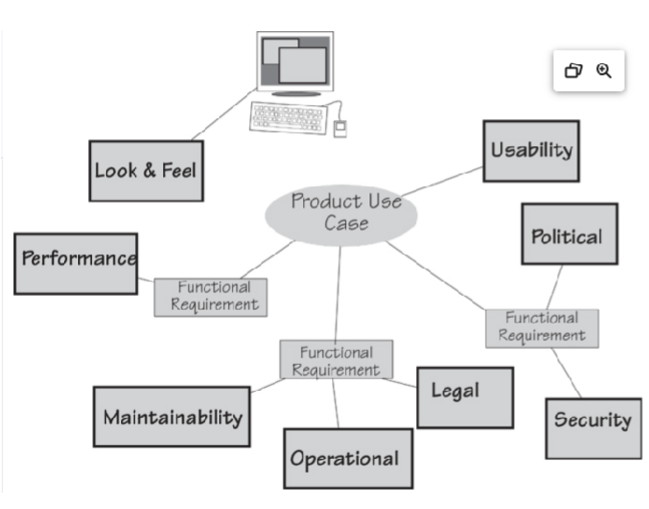

# Study Guide: Communicating the Requirements (Nonfunctional Requirements - NFRs)

## Key Concepts

### Nonfunctional Requirements (NFRs)
- **Nonfunctional Requirements (NFRs)**, also called **quality attributes** or **quality of service** requirements, describe **how well** the software must perform, rather than **what** it must do (which is covered by functional requirements).
- **Why are NFRs important?**  
  - They ensure that the software works well enough to be used (e.g., is fast, secure, reliable, user-friendly).

    
  *Figure 11.2: Example of how nonfunctional requirements relate to functional requirements.*

---

## Examples of NFRs

1. **Functional Requirement (FR)**: "The IceBreaker product shall record road temperatures."
2. **Security NFR**: "Once recorded, the data shall not be altered except by a supervising engineer."
3. **Performance NFR**: "The data shall be recorded within 0.5 seconds of receipt."

---

## How to Identify NFRs

- **Sources**:  
  - Elicit directly from stakeholders.
  - Use prototypes to identify missing NFRs.
  - Apply a checklist of the 8 major categories of NFRs to each product use case.

- **Steps**:
  1. For each product use case, ask whether each NFR category applies.
  2. Document and validate with stakeholders.

---

## The 8 Major Categories of Nonfunctional Requirements

1. **Look & Feel**
   - Appearance, design, and branding.
   - **Example**: "The product shall use the company colors."
2. **Usability**
   - Ease of use, learning curve, and accessibility.
   - **Example**: "The product shall produce a schedule that is easy to read."
3. **Performance**
   - Speed, accuracy, capacity, reliability, and fault tolerance.
   - **Example**: "The product shall identify hostile aircraft within 0.25 seconds."
4. **Operational**
   - Environmental requirements or context in which the product operates.
   - **Example**: "The product shall be usable in low-light conditions."
5. **Maintainability**
   - Ease of updates and future changes.
   - **Example**: "The product shall support easy addition of new road authority areas."

---

### Additional Categories of NFRs (Cont.)

6. **Security**
   - Confidentiality, privacy, data integrity, and auditability.
   - **Example**: "The product shall ensure account data can only be accessed by authorized users."
7. **Cultural & Political**
   - Market or region-specific considerations.
   - **Example**: "The product shall use American spelling."
8. **Legal**
   - Laws, standards, and compliance.
   - **Example**: "The product shall produce an audit report that complies with ISO standards."

---

## Key Considerations for NFRs

### Rationale
- If the need for a requirement is unclear, include a **rationale** explaining why it is necessary.
  - **Example**: "The product shall be easy to use on the first try."
  - **Rationale**: "We want our customers to voluntarily switch to this new product."

### Fit Criteria
- To avoid vague NFRs, ensure they are measurable with **fit criteria** (e.g., specifying time limits, capacity, etc.).
  
  **Example**:  
  - Vague: "The system must be fast."  
  - Measurable: "The system must process requests in under 1 second."

---

## Cross-References and Trade-offs

- **Cross-reference**:  
  - There may be overlaps between functional and nonfunctional requirements.
  - **Example**: "The product shall provide a firewall" could be either a functional or a security NFR.

- **Trade-offs**:  
  - Sometimes one NFR can conflict with another.
  - **Example**: Password-protection increases security but may reduce usability due to added steps.

---

## Summary

- NFRs are critical for ensuring software quality and usability.
- They span 8 major categories and should be carefully elicited, documented, and validated.
- Always provide clear, measurable criteria for each NFR and consider the impact of NFRs on other aspects of the system.

