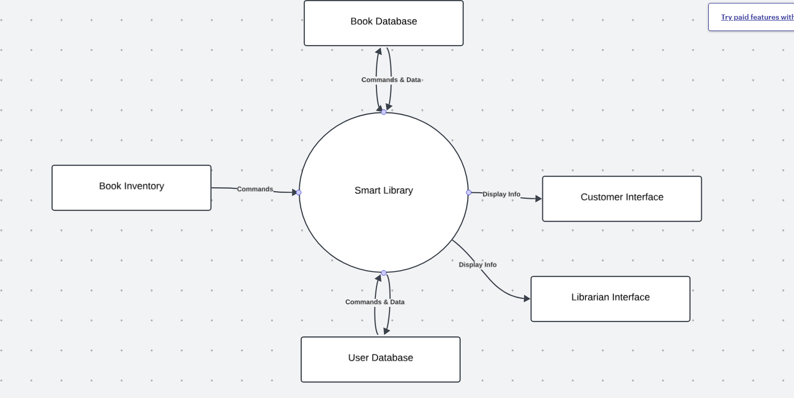

# Practice Test: Requirements Gathering for SmartLibrary System

## System Overview: SmartLibrary

**SmartLibrary** is a software system designed to help public libraries manage book loans, reservations, returns, and inventory. The system serves both library users (patrons) and library staff. Patrons can search the catalog, reserve books, and receive notifications for due dates. Staff can manage inventory, handle bulk updates, and generate reports on library usage.

---

## Section 1: Context Diagram

### Task:
Draw a **context diagram** for the SmartLibrary system.

### Answers:
1. **What is the system boundary?**  
   - The system boundary is the **SmartLibrary software**, which handles core functionalities like book management, reservations, and notifications. External actors (patrons, staff, book databases) interact with this system.

2. **Who are the external actors?**  
   - **Library Patrons**: Use the system to browse, reserve, and manage book loans.
   - **Library Staff**: Manage book inventory, handle overdue items, and generate reports.
   - **Book Database**: Provides information on available books across multiple libraries.
   - **Book Inventory**: Tracks physical inventory at the local library.
   - **User Database**: Stores information about patrons (e.g., membership, borrowing history).

3. **What data or interactions flow between SmartLibrary and these external actors?**  
   - **Patrons** interact with the system to browse and reserve books (Display Info, Commands).
   - **Staff** interact to manage inventory and generate reports (Commands & Data).
   - **Book Database** and **Inventory** exchange data about book availability, titles, and conditions (Commands & Data).
   - **User Database** holds patron data like loan history and current reservations (Commands & Data).

---

## Section 2: Business Use Case vs Product Use Case

### Answers:
1. **Business Use Case**:
   - **Business Process**: The library's goal is to manage book loans, reservations, returns, and inventory in a seamless way for both patrons and staff.
   - **Stakeholders**: 
     - Library Patrons: Want a simple interface to browse, reserve, and manage loans.
     - Library Staff: Need tools to manage book inventory, track overdue books, and generate reports.
     - Library Management: Oversees the system to ensure it supports daily operations.
   - **External Factors**: 
     - Book suppliers may need to integrate with the system to update availability.
     - Integration with external databases (e.g., national library databases).

2. **Product Use Case**:
   - **Handled by SmartLibrary**: 
     - Book reservation, loan extensions, notifications (for due dates and reservations).
     - Inventory management (staff adds/removes books, tracks availability).
   - **Automated Processes**:
     - Real-time updates to book availability.
     - Automatic notifications for overdue books or upcoming due dates.
   - **Actor Interaction**:
     - Patrons interact via the **Customer Interface** for reservations and loans.
     - Staff uses the **Librarian Interface** to manage the inventory and generate reports.

---

## Section 3: Use Case Diagrams

### Answers:
1. **Major Use Cases for SmartLibrary**:
   - **Book Reservation**: Patrons reserve a book from the catalog.
   - **Loan Extension**: Patrons extend their loan if no reservations exist.
   - **Inventory Management**: Staff add, update, or remove books from the system.
   - **Notifications**: The system sends reminders about due dates and overdue books.
   
2. **Actors in Each Use Case**:
   - **Patron**: Interacts with the system for book reservation, loan management.
   - **Library Staff**: Manages the inventory, handles loans, and generates reports.
   - **Book Database**: Provides data on available books.

3. **Boundaries**:
   - The actors (Patron, Staff, Book Database) interact with the **SmartLibrary system**.
   - The system handles the internal logic for inventory management and notifications.

---

## Section 4: Scenarios

### Answers:
1. **Normal Flow Scenario**:  
   - **Use Case**: Book Reservation  
   - **Steps**: 
     1. Patron logs into the system.
     2. Patron searches for a book.
     3. System displays the available books.
     4. Patron selects a book and reserves it.
     5. System confirms the reservation.
   - **Preconditions**: Patron is logged in, book is available.
   - **Outcome**: The book is successfully reserved.

2. **Alternative Flow Scenario**:  
   - **Use Case**: Book Reservation  
   - **Steps**:
     1. Patron logs into the system.
     2. Patron searches for a book.
     3. System displays that the book is reserved by another user.
     4. Patron adds the book to their waitlist.
   - **Outcome**: The book is added to the waitlist and the patron is notified when available.

3. **Exception Flow Scenario**:  
   - **Use Case**: Book Reservation  
   - **Steps**:
     1. Patron logs into the system.
     2. Patron searches for a book.
     3. System fails to connect to the book database.
     4. System displays an error message: "Unable to retrieve book information. Please try again later."
   - **Outcome**: Patron cannot reserve the book due to system failure.

---

## Section 5: Functional Requirements

### Answers:
1. **Functional Requirements for Normal Flow (Book Reservation)**:
   - "The system shall allow the patron to search for books in the catalog."
   - "The system shall check book availability in real time."
   - "The system shall allow patrons to reserve available books."
   - "The system shall confirm successful reservations."

2. **Clear and Testable**:  
   - Each requirement is clear, specific, and can be tested by verifying if the system performs the actions described (e.g., confirming reservation).

---

## Section 6: Nonfunctional Requirements (NFRs)

### Answers:
1. **Performance Requirements**:  
   - "The system shall respond to search queries within 2 seconds."
   - "The system shall process book reservations within 1 second."

2. **Security Requirements**:  
   - "The system shall require user authentication for all book reservations."
   - "The system shall encrypt patron data during transactions."

3. **Usability Requirements**:  
   - "The system shall provide an intuitive interface for first-time users with minimal navigation steps."
   - "The system shall support accessibility features, including screen readers."

4. **Maintainability Requirements**:  
   - "The system shall support regular software updates without downtime."
   - "The system shall allow easy addition of new books and inventory updates."

---

## Section 7: Cross-References and Trade-offs

### Answers:
1. **Cross-references**:  
   - **Functional and Security Requirements**: User authentication for reservations is a functional need, but also ensures the system complies with security standards (e.g., data protection).
   
2. **Trade-offs**:  
   - **Usability vs Security**: Requiring a strong password for every login could impact usability but increases security. A balance may be needed (e.g., offer "Remember Me" functionality for frequent users).

---

## Final Summary:
In this exercise, you worked through the process of gathering requirements for the **SmartLibrary** system, starting with high-level context diagrams, drilling down into use cases and scenarios, and identifying both functional and nonfunctional requirements. You also explored how these requirements overlap and potential trade-offs between usability, security, and performance.
